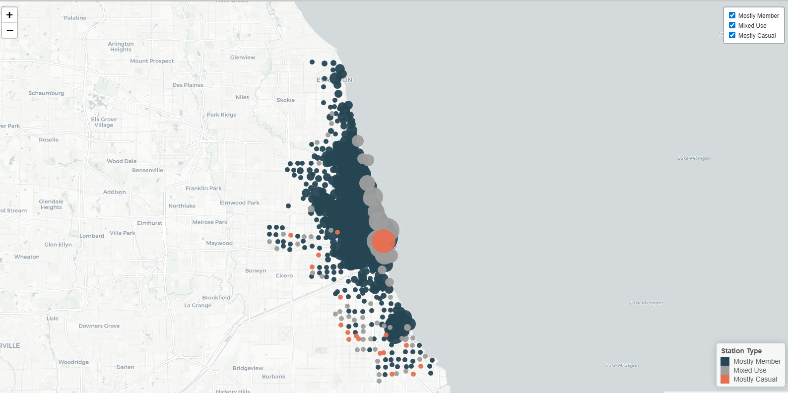
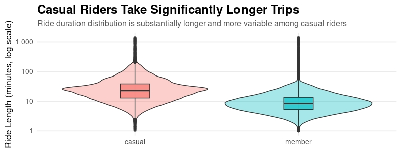
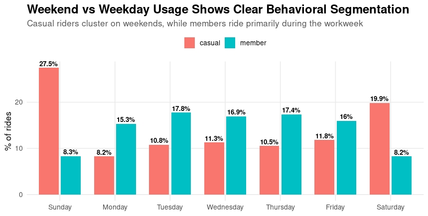
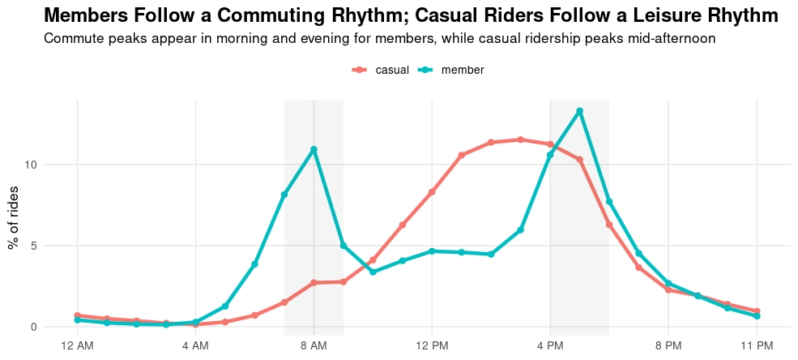
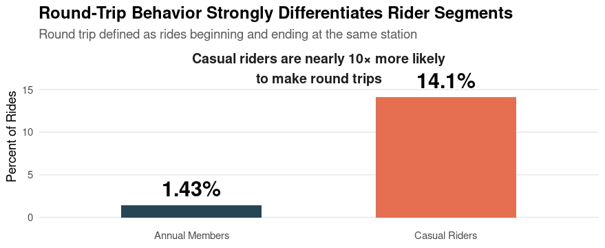

From Leisure to Loyalty: Behavioral Segmentation of Divvy Bike-Share Riders
Behavioral segmentation analysis of Chicago Divvy bike-share riders using R to identify conversion-focused marketing opportunities between casual riders and members.

Project Overview
This project analyzes behavioral differences between casual riders and members of Chicago’s Divvy bike-share system using Q1 2019 and Q1 2020 trip data. The objective of the analysis was to identify behavioral trends that marketing teams could use to develop strategies aimed at converting casual riders into members.
The analysis revealed strong differences in ride duration, riding schedules, station usage patterns, and trip behaviors between both rider groups. Casual riders demonstrated primarily recreational usage patterns, while members showed highly consistent commuter-oriented behavior.

Business Problem
How do riding behaviors differ between casual riders and members across ride duration, timing, frequency, and station usage, and how can these insights support conversion-focused marketing strategies?

Data Sources
Data used in this project was made publicly available by Divvy Bikes / Lyft Bikes and Scooters.
Datasets used:
Divvy_Trips_2019_Q1
Divvy_Trips_2020_Q1
Each row in the dataset represents a single bike trip and includes:
trip start/end timestamps
station information
rider type
ride duration
station coordinates (2020 dataset)

Tools & Technologies
Language: R
Environment: Posit Cloud / RStudio
Libraries:
tidyverse
ggplot2
leaflet
plotly
lubridate
janitor
scales

Data Cleaning & Preparation
The original datasets contained schema inconsistencies and required normalization before analysis.
Key preparation steps included:
Standardized column names between 2019 and 2020 datasets
Harmonized rider type values:
Customer → casual
Subscriber → member
Removed incompatible columns between datasets
Converted ride IDs to character format
Created derived variables:
ride_length
day_of_week
hour
Added missing latitude/longitude columns to the 2019 dataset
Checked for duplicates and datatype inconsistencies
Filtered unrealistic rides:
removed rides under 1 minute
removed rides over 24 hours
The cleaned datasets were combined into a unified analysis dataset using bind_rows().

Analysis Process
The analysis focused on identifying behavioral differences between rider segments through:
Ride Length Analysis
Weekly Riding Pattern Analysis
Hourly Riding Pattern Analysis
Station & Geospatial Analysis
Round-Trip Behavior Analysis
The project emphasized:
exploratory data analysis
behavioral segmentation
business interpretation
recommendation development

Key Insights
Ride Duration Behavior
Casual riders take significantly longer and less consistent rides than members, suggesting recreational and leisure-oriented usage patterns.

Weekly Riding Patterns
Nearly 60% of casual rider trips occur between Friday and Sunday, while members ride most frequently during weekdays, indicating commuter-focused usage.

Hourly Riding Behavior
Members display strong commuting-hour ride spikes during morning and evening work hours. Casual riders peak during afternoon leisure hours.

Geospatial Segmentation
Casual riders cluster around Chicago’s lakefront, parks, attraction-adjacent stations, and recreation corridors, while members concentrate around downtown business districts and transit hubs.

Round-Trip Behavior
Casual riders are nearly 10× more likely to make round trips than members (14.1% vs 1.43%), reinforcing recreational and leisure-oriented usage behavior.

Recommendations
1. Pilot a Weekend-Focused Membership or Ride Bundle
Test a lower-cost weekend-focused plan or ride-credit bundle targeted specifically toward repeat casual riders. This strategy aligns with observed recreational riding behavior while minimizing the risk of existing members downgrading from full memberships.

2. Target High-Concentration Leisure Stations for Conversion Campaigns
Deploy in-app and on-location marketing at high-traffic recreational stations such as lakefront and attraction-adjacent areas.
Example messaging:
“You’ve ridden multiple weekends this month — save with a weekend or annual membership.”

3. Develop Personalized Engagement Campaigns for High-Frequency Casual Riders
Use ride-frequency and behavioral data to identify casual riders who exhibit repeated weekend or recreational usage patterns. Deliver targeted in-app notifications, email campaigns, or app-based usage summaries that highlight potential cost savings and membership benefits based on their riding habits.

Limitations
Only Q1 data was available, limiting seasonal analysis
Limited demographic data prevented deeper customer segmentation
Lack of unique rider IDs prevented identification of repeat casual riders
Station coordinate data was only available in the 2020 dataset

Next Steps
Future analysis opportunities include:
Full-year seasonality analysis
Route-level trip analysis
Rider retention analysis
A/B testing of conversion campaigns
Predictive modeling for rider conversion likelihood

anabsierra_divvy_rider_analysis/
│
├── README.md
├── LICENSE
├── .gitignore
│
├── scripts/
│   └── divvy_rider_segmentation_analysis.R
│
├── visuals/
│   ├── Ride_length_plot.png
│   ├── week_analysis.jpeg
│   ├── hourly_analysis.jpeg
│   ├── full_map_shot.png
│   ├── round_trip_KPI_card.png
│   └── station_density_map.html
│
├── report/
│   └── Divvy_Capstone_Report.pdf
│
├── presentation/
│   └── Divvy_Presentation_Deck.pdf
│
├── data/
│   └── data_source.txt
│
└── README_assets/
    └── optional_future_assets

Project Files
Final Report
[Download the Full Report](report/Ana_Sierra_Capstone_Cycling_Report.pdf)
Presentation Deck
[View the Presentation Deck](presentation/Divvy_Capstone_Deck_Ana_Sierra.pdf)
R Scripts
[View the Script File](scripts/rides_analysis.R)
Visualizations

Author
Ana Sierra
Google Data Analytics Capstone Project
 Portfolio Version – Behavioral Segmentation & Marketing Strategy Analysis